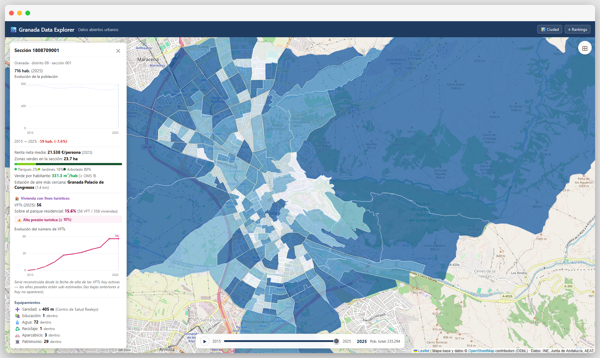

# Granada Data Explorer

**Un observatorio urbano interactivo de la ciudad de Granada, construido sobre datos abiertos.**
Explora en un mapa cómo se reparten la población, la renta, la calidad del aire, el verde
urbano y la vivienda turística —barrio a barrio y año a año— desde fuentes oficiales (INE,
Junta de Andalucía, AEAT y OpenStreetMap).

[](https://granada-data-explorer.pages.dev)
[](LICENSE)
[](DATA_LICENSE.md)

[](https://granada-data-explorer.pages.dev)

> 🔗 **Demo en vivo:** **<https://granada-data-explorer.pages.dev>**

---

## ¿Qué puedes explorar?

El mapa colorea cada **sección censal** o **barrio** de Granada según el indicador que elijas,
con un deslizador temporal para ver su evolución. Algunas preguntas que responde:

- 🧑‍🤝‍🧑 **¿Cómo se reparte la población** y cómo ha crecido o menguado cada zona?
- 🌳 **¿Qué barrios tienen menos espacio verde por habitante?** (con el umbral de 9 m²/hab de la OMS)
- 🌫️ **¿Dónde es peor la calidad del aire?** (exposición a NO₂)
- 💶 **¿Cómo varía la renta** entre unas secciones y otras?
- 🛏️ **¿Qué zonas soportan más presión de vivienda turística** (VFT) sobre el parque residencial?

Además:

- **Ficha por zona** — pulsa cualquier sección o barrio para ver sus indicadores, equipamientos
  cercanos (sanidad, educación, agua, reciclaje…) y la estación de aire más próxima.
- **Rankings** — el top-10 de zonas por población, renta, verde, NO₂, crecimiento o VFT.
- **Panel "Ciudad"** — agregados municipales: pirámide de población, serie histórica de
  habitantes 1996-2025, renta IRPF y evolución de la vivienda turística.

---

## Pruébalo

### En tu navegador

👉 **[Abre la demo en vivo](https://granada-data-explorer.pages.dev)** — no necesitas instalar nada.

### En local (para desarrolladores)

**Requisitos:** Python 3.11+ y Node.js 18+.

El proyecto tiene dos piezas que se ejecutan a la vez: el **backend** (sirve los datos) y el
**frontend** (la interfaz de mapa).

**1. Backend (FastAPI):**

```bash
python -m venv .venv
# Windows: .venv\Scripts\Activate.ps1   ·   Linux/Mac: source .venv/bin/activate
pip install -r backend/requirements.txt
uvicorn backend.main:app --reload --port 8000
```

La API queda en `http://localhost:8000` (`/api/layers`, `/api/layers/{nombre}`,
`/api/demografia`, `/api/health`).

**2. Frontend (Vite + React):** en otra terminal,

```bash
cd frontend
npm install
npm run dev
```

Abre la URL que indique Vite (normalmente `http://localhost:5173`). El frontend habla con el
backend a través de `/api`; para apuntar a otro host, copia `.env.example` a `.env` y define
`VITE_API_URL`.

### Regenerar los datos (opcional)

Los datos procesados ya vienen en `backend/data/`, así que la app funciona sin esto. Para
reconstruirlos desde las fuentes oficiales:

```bash
pip install -r requirements.txt   # pandas, geopandas, shapely
python scripts/prepare_data.py    # o los scripts build_*.py individuales
```

Las tablas del INE se descargan una sola vez y se **cachean** en `raw-data/ine_cache/` (no
versionado); para forzar una actualización, borra esa carpeta o usa `INE_CACHE_REFRESH=1`.
Algunos datasets (calidad del aire, demografía quinquenal) parten de CSVs locales que no se
incluyen en el repositorio — su procedencia está documentada en
[docs/DATA_SOURCES.md](docs/DATA_SOURCES.md).

---

## Cómo funciona

```
frontend/   Interfaz de mapa (React + TypeScript + Leaflet, build con Vite)
backend/    API FastAPI que sirve las capas
  data/     Datos ya procesados que consume la app (versionados)
scripts/    Pipeline en Python (pandas/geopandas) que regenera backend/data/
raw-data/   Datos crudos (NO versionados; reproducibles vía los scripts)
docs/        Documentación de fuentes y métricas
```

El frontend pinta capas **GeoJSON** sobre Leaflet; el backend es un servidor ligero de esas
capas; y el pipeline de `scripts/` descarga las fuentes oficiales, las recorta a Granada y
calcula los indicadores que se embeben en los GeoJSON.

---

## Fuentes de datos

Todos los datos provienen de fuentes oficiales y abiertas. Inventario resumido (detalle
completo, con URLs y transformaciones, en **[docs/DATA_SOURCES.md](docs/DATA_SOURCES.md)**):

| Organismo | Aporta | Licencia |
|---|---|---|
| **INE** | Población, renta, hogares, pirámide y cartografía censal | Reutilización con atribución |
| **Junta de Andalucía** | Vivienda turística (OpenRTA) y calidad del aire (SIVA) | Reutilización con atribución |
| **AEAT** | Renta IRPF municipal | Reutilización con atribución |
| **OpenStreetMap** | Barrios, distritos, viario, parques y puntos de interés | **ODbL** (atribución + share-alike) |

> © OpenStreetMap contributors — datos bajo [ODbL](https://opendatacommons.org/licenses/odbl/).
> Fuentes estadísticas: INE, Junta de Andalucía, AEAT.

## Metodología y limitaciones

Cada indicador del mapa se calcula a partir de estas fuentes mediante un proceso documentado
paso a paso —incluyendo sus **sesgos y limitaciones**— en **[docs/METRICS.md](docs/METRICS.md)**.
Algunos ejemplos de la transparencia que encontrarás ahí:

- La serie histórica de vivienda turística tiene **sesgo superviviente** (solo refleja las VFT
  que siguen activas hoy), así que la *tendencia* es fiable pero los valores absolutos del
  pasado están subestimados.
- La calidad del aire se apoya en **solo 2 estaciones activas**, por lo que la exposición por
  zona es una aproximación gruesa.
- Algunos datos del INE son **experimentales** y se revisan retrospectivamente.

> ⚠️ **Trátalos como datos exploratorios y educativos, no como cifras oficiales para la toma de
> decisiones.** Lee las limitaciones de cada métrica antes de sacar conclusiones.

---

## Licencias

- **Código** (`backend/`, `frontend/`, `scripts/`): [MIT](LICENSE).
- **Datos**: cada dataset conserva la licencia de su fuente —incluido **OpenStreetMap (ODbL,
  atribución + share-alike)**, INE, Junta de Andalucía y AEAT. Condiciones y atribución en
  [DATA_LICENSE.md](DATA_LICENSE.md).

## Contribuir

Las sugerencias, correcciones de datos y mejoras son bienvenidas: abre un *issue* o una *pull
request*. Si reportas un problema con algún indicador, incluye la sección/barrio y el año para
poder reproducirlo.
